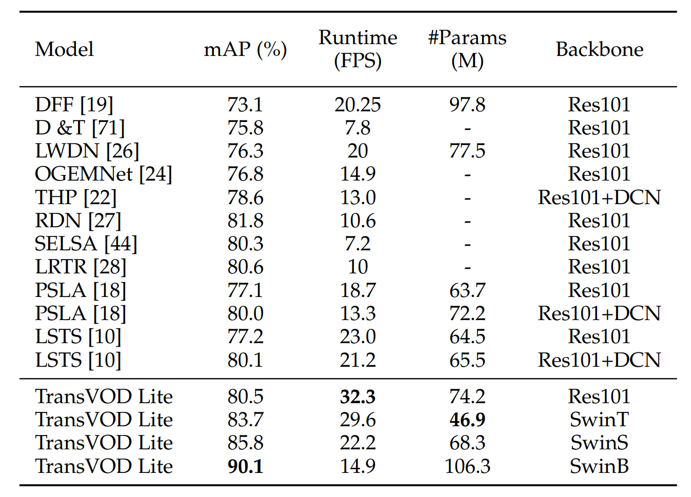

# TransVOD_Lite
**by [Qianyu Zhou](https://qianyuzqy.github.io/), [Xiangtai Li](https://lxtgh.github.io/), [Lu He](https://github.com/SJTU-LuHe)**, [Yibo Yang](), [Guangliang Cheng](), [Yunhai Tong](), [Lizhuang Ma](https://dmcv.sjtu.edu.cn/people/), [Dacheng Tao]()

**[[Arxiv]](https://arxiv.org/pdf/2201.05047.pdf)**
**[[Paper]](https://ieeexplore.ieee.org/document/9960850)**


[](https://paperswithcode.com/sota/video-object-detection-on-imagenet-vid?p=transvod-end-to-end-video-object-detection)

(TPAMI 2023) [TransVOD:End-to-End Video Object Detection with Spatial-Temporal Transformers](https://ieeexplore.ieee.org/document/9960850).

:bell: We are happy to announce that TransVOD was accepted by **IEEE TPAMI**. 

:bell: We are happy to announce that our method is the first work that achieves 90% mAP on ImageNet VID dataset.


## Updates
- (December 2022) Checkpoints of pretrained models are released. 
- (December 2022) Code of TransVOD Lite are released. 

## Citing TransVOD
If you find TransVOD useful in your research, please consider citing:
```bibtex
@article{zhou2022transvod,
 author={Zhou, Qianyu and Li, Xiangtai and He, Lu and Yang, Yibo and Cheng, Guangliang and Tong, Yunhai and Ma, Lizhuang and Tao, Dacheng},  journal={IEEE Transactions on Pattern Analysis and Machine Intelligence},   
 title={TransVOD: End-to-End Video Object Detection With Spatial-Temporal Transformers},   
 year={2022},   
 pages={1-16},  
 doi={10.1109/TPAMI.2022.3223955}}


@inproceedings{he2021end,
  title={End-to-End Video Object Detection with Spatial-Temporal Transformers},
  author={He, Lu and Zhou, Qianyu and Li, Xiangtai and Niu, Li and Cheng, Guangliang and Li, Xiao and Liu, Wenxuan and Tong, Yunhai and Ma, Lizhuang and Zhang, Liqing},
  booktitle={Proceedings of the 29th ACM International Conference on Multimedia},
  pages={1507--1516},
  year={2021}
}
```


## Main Results
Our proposed method TransVOD Lite, achieving the best tradeoff between the speed and accuracy with different backbones. SwinB, SwinS and SwinT mean Swin Base, Small and Tiny.




*Note:*
1. All models of TransVOD are trained  with pre-trained weights on COCO dataset.


## Installation

The codebase is built on top of [Deformable DETR](https://github.com/fundamentalvision/Deformable-DETR) and [TransVOD](https://github.com/SJTU-LuHe/TransVOD).

### Requirements

* Linux, CUDA>=9.2, GCC>=5.4
  
* Python>=3.7

    We recommend you to use Anaconda to create a conda environment:
    ```bash
    conda create -n TransVOD python=3.7 pip
    ```
    Then, activate the environment:
    ```bash
    conda activate TransVOD
    ```
  
* PyTorch>=1.5.1, torchvision>=0.6.1 (following instructions [here](https://pytorch.org/)

    For example, if your CUDA version is 9.2, you could install pytorch and torchvision as following:
    ```bash
    conda install pytorch=1.5.1 torchvision=0.6.1 cudatoolkit=9.2 -c pytorch
    ```
  
* Other requirements
    ```bash
    pip install -r requirements.txt
    ```

* Build MultiScaleDeformableAttention
    ```bash
    cd ./models/ops
    sh ./make.sh
    ```

## Usage

### Checkpoints

Below, we provide checkpoints, training logs and inference logs of TransVOD Lite for different backbones.

[DownLoad Link of Google Drive](https://drive.google.com/drive/folders/1eqpiVLAWA_oPYiGmP6CW03WJlXVDjy6e?usp=share_link)

[DownLoad Link of Baidu Netdisk](https://pan.baidu.com/s/1WAXRgXODX1tZ5PNkNOGDaA) (password:26xc)


### Dataset preparation

1. Please download ILSVRC2015 DET and ILSVRC2015 VID dataset from [here](https://image-net.org/challenges/LSVRC/2015/2015-downloads). Then we covert jsons of two datasets by using the [code](https://github.com/open-mmlab/mmtracking/blob/master/tools/convert_datasets/ilsvrc/). You can directly download the joint json file [json](https://drive.google.com/drive/folders/1cCXY41IFsLT-P06xlPAGptG7sc-zmGKF?usp=sharing)  of the two datasets that we have already converted. After that, we recommend to symlink the path to the datasets to datasets/. And the path structure should be as follows:

```
code_root/
└── data/
    └── vid/
        ├── Data
            ├── VID/
            └── DET/
        └── annotations/
        	  ├── imagenet_vid_train.json
              ├── imagenet_vid_train_joint_30.json
        	  └── imagenet_vid_val.json

```

### Training
We use Swin Transformer as the network backbone. We train our TransVOD with Swin-base as backbone as following:

#### Training on single node
1. Train SingleFrameBaseline. You can download COCO pretrained weights from the aforementioned link. 
   
```bash 
GPUS_PER_NODE=8 ./tools/run_dist_launch.sh $1 swinb $2 configs/swinb_train_single.sh
```  
2. Train TransVOD Lite. Using the model weights of SingleBaseline as the resume model.

```bash 
GPUS_PER_NODE=8 ./tools/run_dist_launch.sh $1 swinb $2 configs/swinb_train_multi.sh
``` 


#### Training on slurm cluster
If you are using slurm cluster, you can simply run the following command to train on 1 node with 8 GPUs:
```bash
GPUS_PER_NODE=8 ./tools/run_dist_slurm.sh <partition> swinb 8 configs/swinb_train_multi.sh
```

### Evaluation
You can get the config file and pretrained model of TransVOD (the link is in "Checkpoint" session), then put the pretrained_model into correponding folder.
```
code_root/
└── exps/
    └── our_models/
        ├── COCO_pretrained_model
        ├── exps_single
        └── exps_multi
```
And then run following command to evaluate it on ImageNET VID validation set:
```bash 
GPUS_PER_NODE=8 ./tools/run_dist_launch.sh $1 eval_swinb $2 configs/swinb_eval_multi.sh
```

## Acknowledgements

This project is based on the following open-source projects. We thank their
authors for making the source code publically available.

* [Deformable DETR](https://github.com/fundamentalvision/Deformable-DETR)


## License

This project is released under the [Apache License 2.0](LICENSE), while some 
specific features in this repository are with other licenses. Please refer to 
[LICENSES.md](LICENSES.md) for the careful check, if you are using our code for 
commercial matters.


